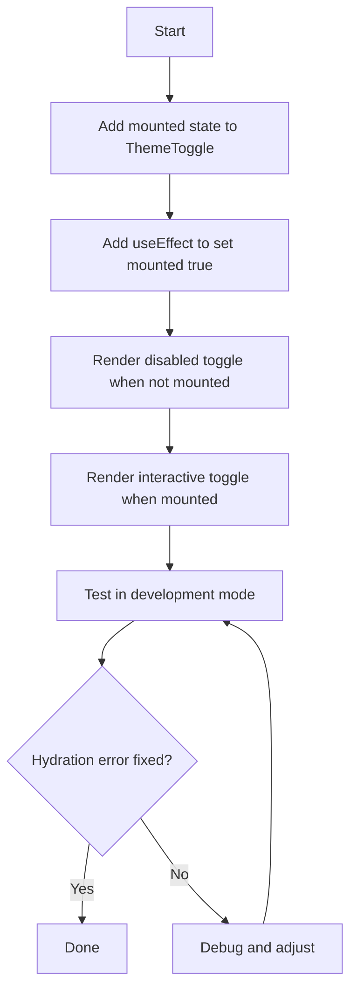

# Fix ThemeToggle Hydration Mismatch

## Problem Analysis

### The Error
The hydration mismatch occurs in the [`ThemeToggle`](components/theme-toggle.tsx) component:

```
Server: aria-pressed="false", data-state="off"
Client: aria-pressed={true}, data-state="on"
```

### Root Cause

The issue stems from how [`next-themes`](https://github.com/pacocoursey/next-themes) works with Server-Side Rendering:

1. **Server Render**: On the server, `useTheme()` returns `theme === undefined` initially because the actual theme preference (stored in localStorage or system preference) is not available during SSR
2. **Client Hydration**: On the client, `next-themes` immediately reads the theme from localStorage/system preference, which might be `"dark"`
3. **Mismatch**: The Toggle component evaluates `pressed={theme === "dark"}`:
   - Server: `undefined === "dark"` → `false` → renders `data-state="off"`
   - Client: `"dark" === "dark"` → `true` → expects `data-state="on"`

This causes React to warn about the hydration mismatch because the server-rendered HTML doesn't match what the client expects.

### Current Implementation

```tsx
// components/theme-toggle.tsx
export function ThemeToggle() {
  const { theme, setTheme } = useTheme()

  return (
    <Toggle
      pressed={theme === "dark"}  // ❌ This causes hydration mismatch
      onPressedChange={(pressed) => setTheme(pressed ? "dark" : "light")}
      ...
    >
```

## Solution Options

### Option 1: Mount State Pattern (Recommended)

Use a mounted state to only render the interactive toggle after client-side hydration:

```tsx
"use client"

import { useTheme } from "next-themes"
import { useEffect, useState } from "react"
import { Toggle } from "@/components/ui/toggle"

export function ThemeToggle() {
  const [mounted, setMounted] = useState(false)
  const { theme, setTheme } = useTheme()

  useEffect(() => {
    setMounted(true)
  }, [])

  // Render placeholder during SSR to avoid hydration mismatch
  if (!mounted) {
    return (
      <Toggle aria-label="Toggle theme" className="size-8" disabled>
        {/* Same SVG icon */}
      </Toggle>
    )
  }

  return (
    <Toggle
      pressed={theme === "dark"}
      onPressedChange={(pressed) => setTheme(pressed ? "dark" : "light")}
      aria-label="Toggle theme"
      className="size-8"
    >
      {/* SVG icon */}
    </Toggle>
  )
}
```

**Pros:**
- Clean solution that follows next-themes documentation
- No flash of incorrect state
- Button remains visible (just non-interactive during hydration)

**Cons:**
- Very brief moment where toggle is disabled

### Option 2: Use resolvedTheme Instead

The `resolvedTheme` property from `useTheme()` handles the resolution of "system" theme:

```tsx
const { resolvedTheme, setTheme } = useTheme()

// Still need mounted check for SSR
if (!mounted) return <Skeleton />

return (
  <Toggle pressed={resolvedTheme === "dark"} ... />
)
```

**Note**: This still requires the mounted pattern because `resolvedTheme` is also undefined on the server.

### Option 3: Skeleton/Placeholder Approach

Render a skeleton placeholder during SSR:

```tsx
if (!mounted) {
  return <div className="size-8 animate-pulse bg-muted rounded" />
}
```

**Cons:**
- Visual layout shift as placeholder replaces actual button

## Recommended Solution

**Option 1: Mount State Pattern** is the recommended approach because:

1. It's the officially recommended pattern from `next-themes` documentation
2. The toggle button remains visible and correctly sized during SSR
3. Only the interactive state (`pressed`) is deferred to client
4. Minimal visual impact

## Implementation Plan



## Files to Modify

| File | Changes |
|------|---------|
| [`components/theme-toggle.tsx`](components/theme-toggle.tsx) | Add mounted state pattern |

## Code Changes

The final [`components/theme-toggle.tsx`](components/theme-toggle.tsx) should look like:

```tsx
"use client"

import { useEffect, useState } from "react"
import { Toggle } from "@/components/ui/toggle"
import { useTheme } from "next-themes"

export function ThemeToggle() {
  const [mounted, setMounted] = useState(false)
  const { theme, setTheme } = useTheme()

  useEffect(() => {
    setMounted(true)
  }, [])

  return (
    <Toggle
      pressed={mounted ? theme === "dark" : false}
      onPressedChange={(pressed) => setTheme(pressed ? "dark" : "light")}
      aria-label="Toggle theme"
      className="size-8"
      disabled={!mounted}
    >
      <svg
        xmlns="http://www.w3.org/2000/svg"
        width="24"
        height="24"
        viewBox="0 0 24 24"
        fill="none"
        stroke="currentColor"
        strokeWidth="2"
        strokeLinecap="round"
        strokeLinejoin="round"
        className="size-4.5"
      >
        <path stroke="none" d="M0 0h24v24H0z" fill="none" />
        <path d="M12 12m-9 0a9 9 0 1 0 18 0a9 9 0 1 0 -18 0" />
        <path d="M12 3l0 18" />
        <path d="M12 9l4.65 -4.65" />
        <path d="M12 14.3l7.37 -7.37" />
        <path d="M12 19.6l8.85 -8.85" />
      </svg>
      <span className="sr-only">Toggle theme</span>
    </Toggle>
  )
}
```

### Key Changes:
1. Added `mounted` state initialized to `false`
2. Added `useEffect` to set `mounted` to `true` after hydration
3. Changed `pressed` prop to use `mounted ? theme === "dark" : false`
4. Added `disabled={!mounted}` to prevent interaction before hydration

This ensures the server and client both render `pressed={false}` initially, then the client updates to the correct state after mounting.

## Testing

After implementation:
1. Run `npm run dev` 
2. Open the browser dev console
3. Refresh the page
4. Verify no hydration mismatch errors appear
5. Test that theme toggle works correctly
6. Test that system preference detection works

## References

- [next-themes documentation](https://github.com/pacocoursey/next-themes#avoid-hydration-mismatch)
- [React Hydration Mismatch](https://react.dev/link/hydration-mismatch)
